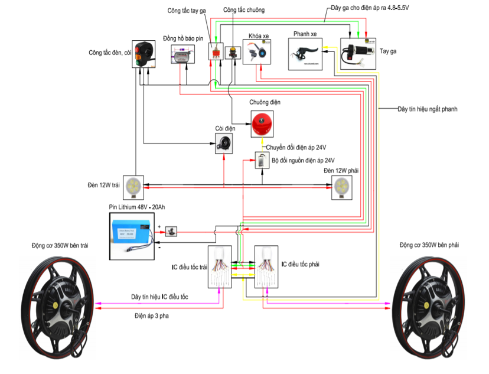

# IXR-TEAM: Dự án chuyển đổi xe thu gom rác đẩy tay sang xe điện sử dụng công nghệ hỗ trợ lái định vị bằng la bàn  

Dự án "NGHIÊN CỨU CHUYỂN ĐỔI XE THU GOM RÁC ĐẨY TAY SANG XE ĐIỆN SỬ DỤNG CÔNG NGHỆ HỖ TRỢ LÁI ĐỊNH VỊ BẰNG LA BÀN" là một dự án nghiên cứu của Đại học Bách khoa Hà Nội với sự hợp tác của Trường Cơ khí và Trường Điện - Điện tử. Dự án bắt đầu từ 2019 và đã có nhiều kết quả đạt được. Dưới đây là những chia sẻ mà chúng tôi - IXR-Team những người thự hiện dự án còn lưu trữ:  
  
### Mục lục

- [Nội dung chính](#)
    - [Mục lục](#)
  - [Thiết kế của hệ thống](#Architecture)
  - [Các thuật toán sử dụng ](#Tools)
  - [Tài liệu tham khảo](#upload)
  
  
## Thiết kế của hệ thống
Để có cái nhìn chung về hệ thống, dưới dây là sơ đồ khối của hệ thống điện:

    

Qua sơ đồ khối, khối cung cấp năng lượng chính cho hệ thống là cục pin 48V, nguồn điện này sẽ được chia ra cho các chức năng: Điều khiển động cơ (cấp nguồn cho driver và động cơ), thực thi lệnh điều khiển (cấp điện cho tay ga để điều khiển driver hoặc cấp điện cho mạch hỗ trợ lái cũng điều khiển driver).  
Nhìn chung khối điều khiển đều cấp lệnh cho driver động cơ để điều khiển nhưng nguyên lý của chúng khác nhau: 
- Tay ga sẽ sử dụng nguyên lý chia điện áp để thay đổi hiệu điện thế của đầu vào Driver từ đó điều khiển tốc độ động cơ  
- Mạch hỗ trợ lái sẽ điều khiển Driver dựa theo tín hiệu xung vuông: Cấp điện áp với hiệu điện thế U1 = A (Voltage) để điều khiển khiển bật động cơ, U0 = 0 (Voltage) để ngắt động cơ. Dự vào việc bật và tắt này sẽ thay đổi tốc độ động cơ và momen lực của cả 2 bánh xe.  

Sơ đồ hệ thống điện khi sử dụng chức năng điều khiển bằng tay:

    

Sơ đồ trên dựa theo nguyên lý của mạch điện trong xe đạp điện, hệ thống xe rác điện hoàn thiện đã xóa bỏ đèn sinh nhan, đèn sau của một chiếc xe điện còn nguyên lý chung thì vẫn giữ nguyên.  

Còn đây là sơ đồ nguyên lý của mạch điện điều khiển hỗ trợ lái:

    

Giống như phần giải thích bên trên, để điều khiển cấp tín hiệu xung cho Driver động cơ, tôi đã lựa chọn Relay từ để đóng mở dòng điện đi vào các chân của Driver động cơ. Tôi cũng đã thử nhiều cách điều khiển khác như: Băm xung, dùng triac, dùng opto, dùng digital Pin của Vi xử lý... nhưng đều thất bại nên có thể coi relay là phương án cuối.  
## Các thuật toán sử dụng

Về thuật toán điều khiển dưới đây là thuật toán chính sử dụng:  

    

Về thuật toán phát hiện sai số đi trên đường, tôi sử dụng một thư viện [Arduino MPU6050](https://github.com/jarzebski/Arduino-MPU6050/tree/master/MPU6050_gyro_pitch_roll_yaw/) để tìm gia các giá trị Pitch, Roll và yaw để xử lý góc lệch [tài liệu về Pitch, Roll, yaw bạn có thể đọc qua ở đây](https://www.facebook.com/kythuathkvt/photos/-roll-li%E1%BB%87ng-yaw-h%C6%B0%E1%BB%9Bng-pitch-ch%C3%BAc-ng%C3%B3c-ailerons-c%C3%A1nh-li%E1%BB%87ng-rudder-c%C3%A1nh-l%C3%A1i-h%C6%B0%E1%BB%9Bng-/1847013308743569/). Sau đó tôi đã sử dụng thông số Yaw để tính sai số cho hệ thống.  
Về việc điều khiển lại động cơ, tôi sử dụng một hàm PID để thay đổi giá trị bật hoặc tắt ở 2 Relay nối với 2 IC Driver của động cơ [về PID, bạn có thể tham khảo ý tưởng thuật toán ở video này](https://youtu.be/tKLFX3b88vM).  

## Tài liệu tham khảo
Tôi có một kênh Youtube với 1, 2 video về dự án xe rác này, bạn có thể xem nó tại địa chỉ:
- https://youtu.be/w2dDsoRLLZg  
- https://youtu.be/0jubcFxC0cE  

Một vài báo cáo và poster sưu tầm lại tôi có để lại tại thư mục Document của dự án, hi vọng có thể hỗ trợ các bạn.  

Một vài link về các bài báo của nhóm: 
- [VTV1](https://vtv.vn/video/viet-nam-thuc-giac-20-7-2020-449595.htm?utm_source=zalo&utm_medium=zalo&utm_campaign=zalo&zarsrc=30)
- [VTV4](https://www.youtube.com/watch?v=CKj6IWaBsU4&t=981s)
- [Hà Nội 1](https://hanoitv.vn/nho-loi-bac-day--nhung-nha-sang-che-tre-vi-nguoi-lao-dong-v145611.html)
- [Zings New](https://zingnews.vn/video-sinh-vien-che-tao-xe-gom-rac-dien-tu-dong-van-hanh-post1109113.html)
- [VTC videos](https://vtc.vn/kham-pha-cong-nghe-xe-cho-rac-tu-lai-cua-sinh-vien-dai-hoc-bach-khoa-ha-noi-ar557743.html)
- [Vietnamnet](ttps://vietnamnet.vn/sinh-vien-ha-noi-che-tao-xe-gom-rac-thong-minh-tu-lai-theo-la-ban-V88317.html)
- [Nguoiduatin](ttps://www.nguoiduatin.vn/nhin-rac-bua-vay-ha-noi-sinh-vien-tung-chieu-che-tao-xe-gom-rac-tu-lai-a483704.html)
- [Báo Hà Nội mới](ttps://hanoimoi.com.vn/tin-tuc/Khoa-hoc/973516/sang-tao-cho-cuoc-song-them-xanh)
